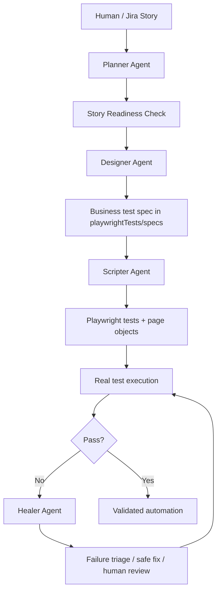
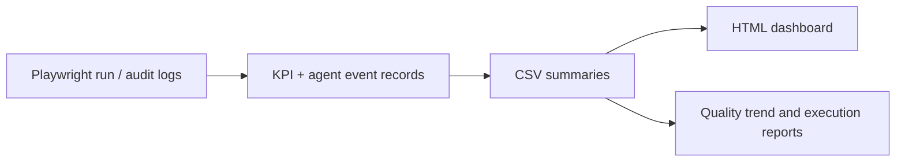
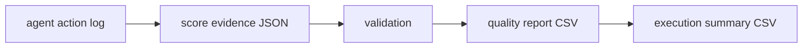

# One-Page Architecture Brief

## Purpose

This repository is a governed, AI-assisted Playwright QA framework. It turns Jira stories into verifiable browser automation while keeping human review gates, security controls, and execution logs in place.

The repo is centered on:
- [.github](.github) for governance, prompts, agent definitions, skills, and scripts
- [playwrightTests](playwrightTests) for the actual Playwright project
- [audit](audit) for agent execution records
- [reports](reports) for aggregated score and KPI outputs
- [playwrightTests/specs](playwrightTests/specs) for business-level test design artifacts

---

## Core workflow

This is the repo’s execution model, documented in [.github/instructions/execution-model.instructions.md](.github/instructions/execution-model.instructions.md) and summarized in [.github/AGENTS.md](.github/AGENTS.md).

---

## Agent roles

- Planner Agent: readiness gate  
  Role defined in [.github/agents/planner-agent.agent.md](.github/agents/planner-agent.agent.md)  
  Skill: [.github/skills/jira-story-readiness/SKILL.md](.github/skills/jira-story-readiness/SKILL.md)

- Designer Agent: scenario planner  
  Role defined in [.github/agents/designer-agent.agent.md](.github/agents/designer-agent.agent.md)  
  Skill: [.github/skills/generate-test-scenarios/SKILL.md](.github/skills/generate-test-scenarios/SKILL.md)

- Scripter Agent: Playwright implementation and execution  
  Role defined in [.github/agents/scripter-agent.agent.md](.github/agents/scripter-agent.agent.md)  
  Skill: [.github/skills/generate-playwright-ui-script/SKILL.md](.github/skills/generate-playwright-ui-script/SKILL.md)

- Healer Agent: failure analysis and safe remediation  
  Role defined in [.github/agents/healer-agent.agent.md](.github/agents/healer-agent.agent.md)  
  Skill: [.github/skills/analyze-playwright-failure/SKILL.md](.github/skills/analyze-playwright-failure/SKILL.md)

---

## Architecture by folder

- [.github](.github): governance, prompts, agents, skills, policies, hooks, and scoring scripts
- [playwrightTests](playwrightTests): actual Playwright harness
  - [playwrightTests/playwright.config.ts](playwrightTests/playwright.config.ts): Playwright config
  - [playwrightTests/pages](playwrightTests/pages): page object models
  - [playwrightTests/fixtures](playwrightTests/fixtures): shared test fixtures
  - [playwrightTests/tests](playwrightTests/tests): executable specs
  - [playwrightTests/specs](playwrightTests/specs): business-level design output
- [audit](audit): raw agent-event logs and generated score evidence
- [reports](reports): KPI and score summaries
- [rtk](rtk): local output reduction utility
- [.github/workflows/playwright.yml](.github/workflows/playwright.yml): CI execution path
- [.github/hooks](.github/hooks): safety checks and output trimming
- [.github/pii-ocr](.github/pii-ocr): redaction and PII handling
- [.github/memory](.github/memory): approved static project knowledge

---

## Report layer

The repository includes a reporting layer that separates raw execution data from the decision-making summaries used by humans.

### Report purpose and responsibilities

- [reports/kpi-report.csv](reports/kpi-report.csv)  
  Raw run ledger for Playwright execution. Tracks real test outcomes over time and provides the basis for trend analysis and pass/fail monitoring.

- [reports/test-execution-report.html](reports/test-execution-report.html)  
  UI-friendly dashboard for QA. Converts the raw KPI history into a readable summary of overall health, recent trend, and execution history.

- [reports/agent-quality-report.csv](reports/agent-quality-report.csv)  
  Agent quality snapshot. Shows per-run outcome and confidence scores for each agent task, along with recommendations and missing metrics.

- [reports/agent-quality-trends.csv](reports/agent-quality-trends.csv)  
  Aggregated quality trend report. Allows teams to compare agent reliability by date, skill, and actor over multiple runs.

- [reports/agent-execution-report.csv](reports/agent-execution-report.csv)  
  Workflow activity log. Captures what each agent did, what story it handled, what workflow stage it was in, and whether the task succeeded or failed.

### report flow

This output layer makes the project auditable: the team can inspect both the raw evidence and the executive summaries without manually reconstructing the sequence of events.

---

## Agent scoring mechanism

The scoring contract is defined in [.github/instructions/agent-quality-scoring-v1.instructions.md](.github/instructions/agent-quality-scoring-v1.instructions.md) and implemented by:
- [.github/scripts/generate-agent-quality-evidence.js](.github/scripts/generate-agent-quality-evidence.js)
- [.github/scripts/validate-agent-quality-evidence.js](.github/scripts/validate-agent-quality-evidence.js)
- [.github/scripts/generate-agent-quality-report.js](.github/scripts/generate-agent-quality-report.js)
- [.github/scripts/generate-agent-execution-report.js](.github/scripts/generate-agent-execution-report.js)

### Scoring flow
1. Agent action is logged to [audit/agent-actions](audit/agent-actions)
2. Score evidence is generated into [audit/agent-quality](audit/agent-quality)
3. Evidence is validated
4. Aggregated CSV reports are created in [reports](reports)

### Outcome score
Each agent uses weighted metrics. Example:
- Planner: readiness-related measures
- Designer: coverage + test quality + uniqueness
- Scripter: syntax, framework compliance, assertions, reusability
- Healer: reproduction, classification, healing success, regression safety

### Confidence score
Confidence is derived from:
- Evidence Completeness
- Validation Pass Rate
- Historical Accuracy

### Confidence bands
- 90–100: High confidence
- 75–89: Medium confidence
- 60–74: Low confidence
- below 60: Not reliable

---

## Example repo artifact chain

Example actual files:
- [audit/agent-actions/2026-09-25T10-42-15-440Z_jira-story-readiness.json](audit/agent-actions/2026-09-25T10-42-15-440Z_jira-story-readiness.json)
- [audit/agent-quality/2026-09-25T10-42-15-440Z_jira-story-readiness_evt-20260925-104215440.score.json](audit/agent-quality/2026-09-25T10-42-15-440Z_jira-story-readiness_evt-20260925-104215440.score.json)
- [reports/agent-quality-report.csv](reports/agent-quality-report.csv)
- [reports/agent-execution-report.csv](reports/agent-execution-report.csv)

---

## Safety and governance

The repo explicitly enforces:
- no direct Jira writes by agents
- no production target without human confirmation
- no secrets or real credentials in code
- no silent weakening of assertions
- no broad auto-fix for uncertain failures

These are documented in:
- [.github/instructions/guardrails-policy.instructions.md](.github/instructions/guardrails-policy.instructions.md)
- [.github/copilot-instructions.md](.github/copilot-instructions.md)

---

## One-sentence summary

This repo is an auditable AI QA pipeline that converts Jira stories into Playwright automation, validates the process with agent scoring, and keeps every step traceable through logs, evidence, and reports.
